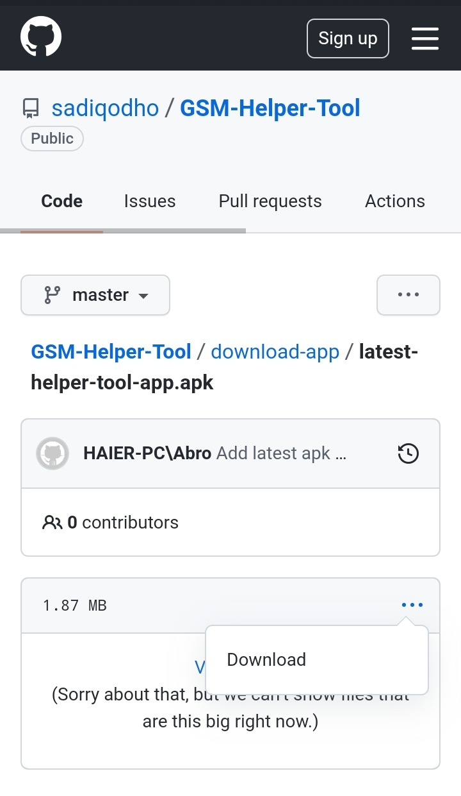

## Step-by-step guide on how to send SMS from an application via an Android phone

### 🌀 Step 1 - Download [GSM Modem app](https://play.google.com/store/apps/details?id=com.gsmmodem) from Google Play


### 🌀 Step 2 - Download and install [GSM Helper Tool](https://play.google.com/store/apps/details?id=com.gsmmodem) from GitHub

#### You can find more information about this tool [here](https://github.com/sadiqodho/GSM-Helper-Tool#readme).




### 🌀 Step 3 - Create a user on GSM Modem application:

#### Open the application and go to Users.


#### Press on the plus button and add a user.
#### The username and password entered here will be used in our application to log in to the server provided by the GSM Modem application.


### 🌀 Step 4 - Go back to the main page and start the server


### 🌀 Step 5 - Make sure you have the Helper Tool application running in the background
> Now you can send requests from your application to the server provided by the GSM Modem application on your phone.


### 🌀 Step 6 - Send request from the application

```
public String sendSMSViaPhone(String username, String password, String address, String port, String phone, String message) throws IOException {
        String messageEncoded = URLEncoder.encode(message, "UTF-8");

        return WebClient
                .builder()
                .baseUrl(address + ":" + port)
                .build()
                .post()
                .uri(uriBuilder -> uriBuilder
                        .path("/SendSMS")
                        .queryParam("username", username)
                        .queryParam("password", password)
                        .queryParam("phone", phone)
                        .queryParam("message", messageEncoded)
                        .build())
                .retrieve()
                .bodyToMono(String.class)
                .block();
    }
```

---


## Response :

### ❄ Message sent successfully


Note: If the Helper Tool is not running in the background you will still receive a positive response, but the message will not be delivered.

### ❄ Username or password


Make sure you entered the correct credentials from `Step 3`.

### ❄ Internal Server error


Make sure you start the SMS server from GSM Modem application.


---

## Extra information:

* On `Settings` page, you can set the server port, the receive SMS URL and the number of SMS your phone is allowed to send per minute.
###

#
* On `JSON Sample` page, you find an example on how the send SMS request should look like.
###

